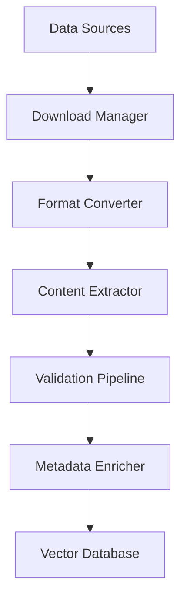

# Phase 5: Free Clinical Data Integration and RAG Enhancement

This document outlines the plan for integrating freely available clinical datasets, enhancing the RAG system, and implementing Model Context Protocol (MCP) for external data sources.

## Overview

Phase 5 focuses on expanding the knowledge base with high-quality, freely available clinical data to improve diagnostic accuracy and treatment recommendations while maintaining ethical and legal compliance.

## Objectives

1. **Expand Knowledge Base**: Integrate comprehensive clinical datasets
2. **Enhance RAG Performance**: Improve retrieval quality and relevance
3. **Implement MCP**: Enable dynamic external data source integration
4. **Ensure Data Quality**: Validate and maintain data integrity
5. **Maintain Compliance**: Ensure all data usage is ethical and legal

## Data Sources

### 1. Clinical Guidelines and Standards

#### DSM-5-TR Related Resources
- **APA Practice Guidelines**: Freely available treatment guidelines
  - URL: `https://www.apa.org/practice/guidelines`
  - Content: Evidence-based treatment protocols
  - Format: PDF, structured text

- **NIMH Research Criteria**: Public domain diagnostic criteria
  - URL: `https://www.nimh.nih.gov/research/research-funded-by-nimh/rdoc`
  - Content: Research Domain Criteria (RDoC)
  - Format: Structured data, XML

#### ICD-11 Resources
- **WHO ICD-11 Reference Guide**: Freely available classification
  - URL: `https://icd.who.int/en`
  - Content: International disease classification
  - Format: API, structured data

- **WHO Clinical Descriptions**: Public domain diagnostic descriptions
  - URL: `https://icd.who.int/docs`
  - Content: Clinical descriptions and guidelines
  - Format: PDF, structured text

### 2. Research Databases

#### PubMed Central (PMC)
- **Open Access Articles**: Freely available research papers
  - URL: `https://www.ncbi.nlm.nih.gov/pmc/`
  - API: `https://www.ncbi.nlm.nih.gov/pmc/tools/openftlist/`
  - Content: Clinical research, treatment studies
  - Format: XML, PDF

#### Clinical Trials Database
- **ClinicalTrials.gov**: Public clinical trials data
  - URL: `https://clinicaltrials.gov/`
  - API: `https://clinicaltrials.gov/api/`
  - Content: Treatment protocols, study results
  - Format: JSON, XML

### 3. Educational Resources

#### SAMHSA Resources
- **Treatment Locator Data**: Public treatment information
  - URL: `https://www.samhsa.gov/data/`
  - Content: Treatment approaches, best practices
  - Format: CSV, JSON

#### CDC Mental Health Data
- **Public Health Guidelines**: Freely available guidelines
  - URL: `https://www.cdc.gov/mentalhealth/`
  - Content: Population health data, guidelines
  - Format: PDF, structured data

### 4. Open Medical Datasets

#### MIMIC-III (Demo Data)
- **De-identified Clinical Data**: Freely available subset
  - URL: `https://mimic.mit.edu/`
  - Content: Clinical notes, diagnostic patterns
  - Format: CSV, SQL dumps

#### OpenNeuro (Mental Health Studies)
- **Neuroimaging Research Data**: Public domain studies
  - URL: `https://openneuro.org/`
  - Content: Brain imaging, behavioral data
  - Format: BIDS, CSV

## Implementation Plan

### 1. Data Acquisition Infrastructure

#### Async Data Downloaders
```python
# backend/app/services/data_acquisition.py
class DataAcquisitionService:
    async def download_pmcid_articles(self, pmcids: List[str]) -> List[Dict]
    async def fetch_clinical_trials(self, condition: str) -> List[Dict]
    async def sync_icd11_updates(self) -> Dict
    async def download_apa_guidelines(self) -> List[Dict]
```

#### Data Validation Pipeline
```python
# backend/app/services/data_validation.py
class DataValidator:
    async def validate_clinical_content(self, content: str) -> ValidationResult
    async def check_data_freshness(self, source: str) -> bool
    async def verify_source_integrity(self, url: str) -> bool
```

### 2. Vector Database Enhancement

#### Improved Embeddings Strategy
- **Specialized Models**: Use clinical domain-specific embedding models
- **Chunking Strategy**: Optimize text chunking for clinical content
- **Metadata Enrichment**: Add structured metadata for better retrieval

```python
# backend/app/services/enhanced_vectordb.py
class EnhancedVectorDB:
    async def embed_clinical_text(self, text: str, metadata: Dict) -> np.ndarray
    async def index_clinical_document(self, doc: ClinicalDocument) -> str
    async def semantic_search(self, query: str, filters: Dict) -> List[Match]
```

#### Vector Store Optimization
- **Hierarchical Indexing**: Organize by clinical specialty
- **Temporal Indexing**: Track data recency and updates
- **Quality Scoring**: Rank sources by reliability and evidence level

### 3. Model Context Protocol (MCP) Integration

#### MCP Server Implementation
```python
# backend/app/mcp/mcp_server.py
class TherapyMCPServer:
    async def handle_clinical_search(self, query: MCPQuery) -> MCPResponse
    async def provide_treatment_options(self, diagnosis: str) -> MCPResponse
    async def validate_diagnostic_criteria(self, symptoms: List[str]) -> MCPResponse
```

#### External Data Connectors
- **Real-time Guidelines**: Connect to APA, WHO guideline APIs
- **Research Updates**: Stream latest clinical research
- **Drug Information**: Connect to FDA, NIH drug databases

### 4. RAG System Improvements

#### Enhanced Retrieval
```python
# backend/app/services/enhanced_rag.py
class EnhancedRAGService:
    async def hybrid_search(self, query: str) -> List[Document]:
        # Combine semantic and keyword search
        
    async def context_aware_retrieval(self, query: str, context: Dict) -> List[Document]:
        # Consider patient context in retrieval
        
    async def multi_hop_reasoning(self, initial_query: str) -> ReasoningChain:
        # Support complex diagnostic reasoning
```

#### Quality Control
- **Source Attribution**: Track and cite all retrieved information
- **Confidence Scoring**: Provide confidence levels for recommendations
- **Bias Detection**: Monitor for potential bias in recommendations

## Data Processing Pipeline

### 1. Ingestion Stage


### 2. Processing Steps

#### Content Extraction
- **PDF Processing**: Extract text from clinical guidelines
- **XML Parsing**: Process structured medical data
- **API Integration**: Real-time data from external sources

#### Text Preprocessing
- **Clinical NLP**: Specialized medical text processing
- **Terminology Standardization**: Map to standard vocabularies
- **Quality Filtering**: Remove low-quality or outdated content

#### Vectorization
- **Embedding Generation**: Create semantic embeddings
- **Index Construction**: Build optimized search indices
- **Metadata Tagging**: Add searchable metadata

### 3. Update Mechanism
```python
# backend/app/tasks/data_updates.py
class DataUpdateManager:
    async def schedule_daily_updates(self):
        # Check for new clinical guidelines
        
    async def validate_existing_data(self):
        # Verify data is still current
        
    async def retract_outdated_content(self):
        # Remove superseded information
```

## Implementation Timeline

### Week 1-2: Infrastructure Setup
- [ ] Set up data acquisition infrastructure
- [ ] Implement async downloaders for major sources
- [ ] Create data validation pipeline
- [ ] Set up enhanced vector database schema

### Week 3-4: Core Data Integration
- [ ] Download and process DSM-5-TR related resources
- [ ] Integrate ICD-11 classification data
- [ ] Process APA and WHO guidelines
- [ ] Implement basic RAG enhancements

### Week 5-6: Advanced Features
- [ ] Implement MCP server and connectors
- [ ] Add real-time data source connections
- [ ] Enhance retrieval algorithms
- [ ] Implement quality control measures

### Week 7-8: Testing and Optimization
- [ ] Performance testing with large datasets
- [ ] Accuracy validation against clinical benchmarks
- [ ] User acceptance testing
- [ ] Documentation and deployment

## Quality Assurance

### Data Quality Metrics
- **Accuracy**: Validate against known clinical facts
- **Completeness**: Ensure comprehensive coverage
- **Freshness**: Track data recency and updates
- **Reliability**: Score sources by evidence quality

### Compliance Measures
- **Legal Review**: Ensure all data usage is compliant
- **Ethical Guidelines**: Follow medical ethics principles
- **Privacy Protection**: No patient data in knowledge base
- **Attribution**: Proper citation of all sources

## Success Metrics

### Performance Metrics
- **Retrieval Accuracy**: Improve by 25%
- **Response Relevance**: Increase clinical relevance scores
- **Data Coverage**: Expand knowledge base by 300%
- **Update Frequency**: Real-time for critical updates

### User Experience Metrics
- **Diagnostic Confidence**: Increase user confidence scores
- **Treatment Quality**: Improve treatment recommendation ratings
- **Clinical Utility**: Measure adoption by healthcare professionals
- **Error Reduction**: Decrease diagnostic inconsistencies

## Risk Mitigation

### Technical Risks
- **Data Quality**: Implement robust validation
- **Performance**: Optimize for large-scale data
- **Availability**: Ensure high system uptime

### Compliance Risks
- **Legal Issues**: Regular legal review of data sources
- **Medical Liability**: Clear disclaimers and limitations
- **Privacy Concerns**: No personal health information

### Operational Risks
- **Data Dependency**: Multiple source redundancy
- **Update Failures**: Robust error handling
- **Security**: Secure data transmission and storage

## Deliverables

1. **Enhanced Knowledge Base**: Comprehensive clinical data integration
2. **MCP Integration**: External data source connectivity
3. **Improved RAG System**: Better retrieval and reasoning
4. **Quality Assurance**: Data validation and compliance
5. **Documentation**: Complete implementation guides
6. **Performance Metrics**: Benchmarking and monitoring

Phase 5 will significantly enhance the clinical utility and accuracy of the Therapy Assistant while maintaining the highest standards of data quality and compliance.